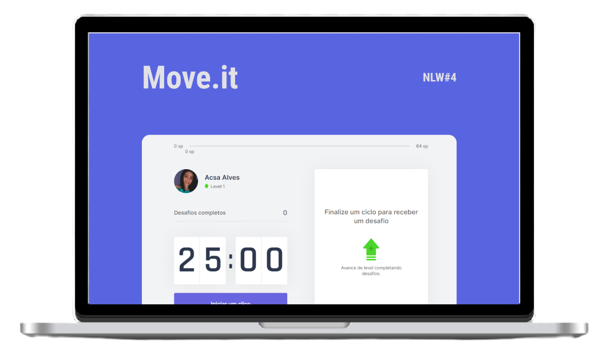

<h1 align="center">
    
</h1>

## 🧪 Tecnologias

Este projeto foi desenvolvido utilizando as seguintes tecnologias:

- [Next.js](https://nextjs.org/)
- [React](https://reactjs.org)
- [TypeScript](https://www.typescriptlang.org/)

## 🔥 Pré-visualização

[](https://moveit-cjpfooiog-acsalves0.vercel.app/index)

## 🚀 Começar

Clonar o projeto e acessar a pasta

```bash
$ git clone https://github.com/acsalves0/NLW-04---REACT.git && cd NLW-04---REACT
```

Siga os passos abaixo
```bash
#  Instalar as dependências
$ yarn

# Iniciar o projeto
$ yarn dev
```
## 💻 Project

Este é um projeto desenvolvido durante o **[Next Level Week](https://nextlevelweek.com/)**, apresentado por **[@Rocketseat](https://github.com/Rocketseat)** durante os dias 22-28 de fevereiro de 2021.